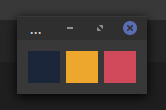

# Color Pallete

A super simple hex color pallete that can sit above all other windows.

Setup your pallete. Dock the window on top. Click to copy the hex code.

## Use Cases

I use this when developing games in Godot. Having to use the same colors between Godot, Blender, Krita, and the web can be a pain. This helps simplify my color workflow ensuring nothing ever gets lost.

## Usage

1. Setup your pallete in `palletes/`
    - See: [Demo Pallete](palletes/demo_pallete.md)
2. Run app:
    > python3 app.py

## Install Dependencies

> pip install PyQt5

## Install as a Desktop App [*Optional*]

1. Update `Exec` and `Icon` path in `pallete.desktop`
2. Copy the file to `~/.local/share/applications`
3. Run: 
    > update-desktop-database ~/.local/share/applications
4. Verify it appears in the start menu. If not, a system restart may be required.

## License

[MIT License](mit_license.md)
